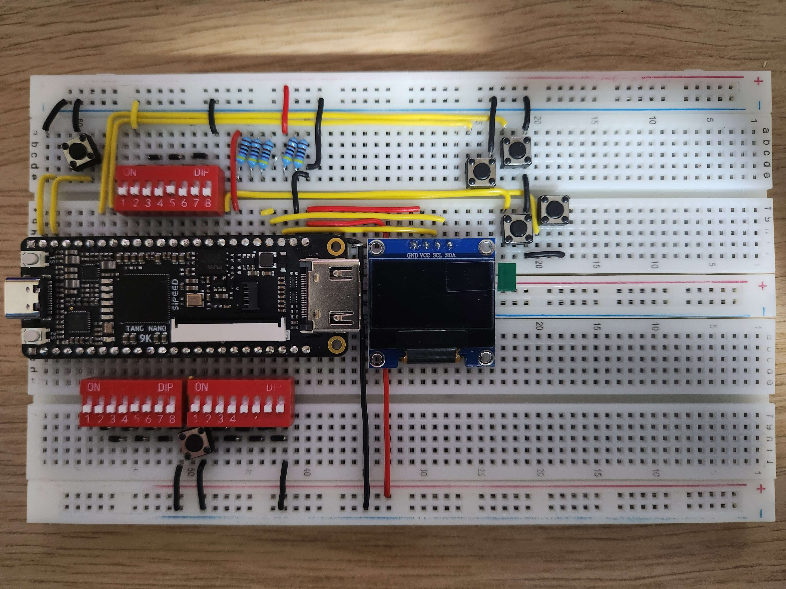
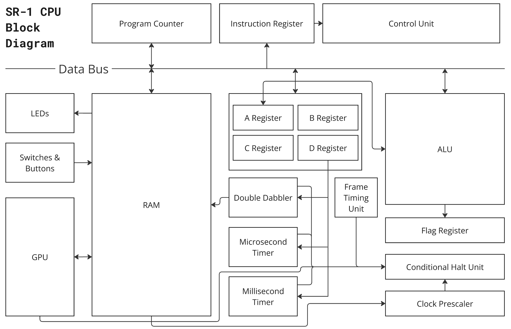
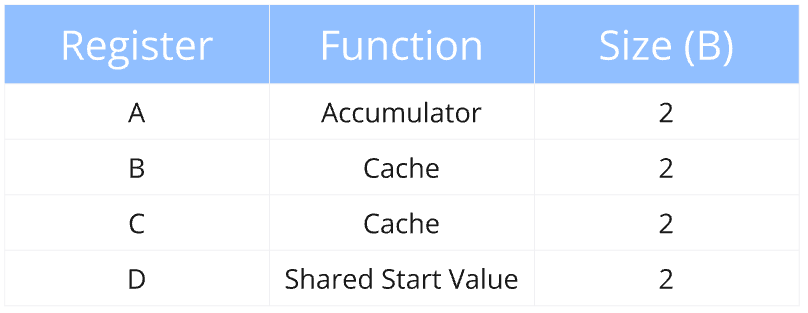
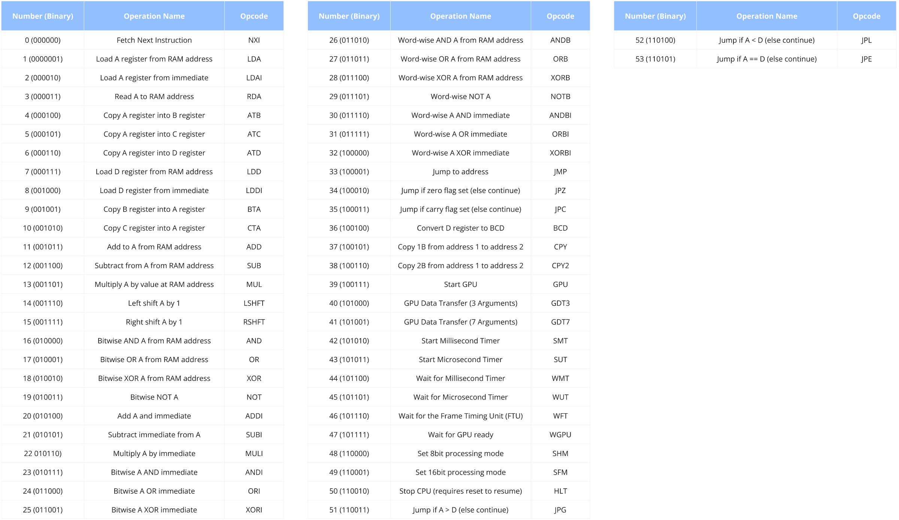
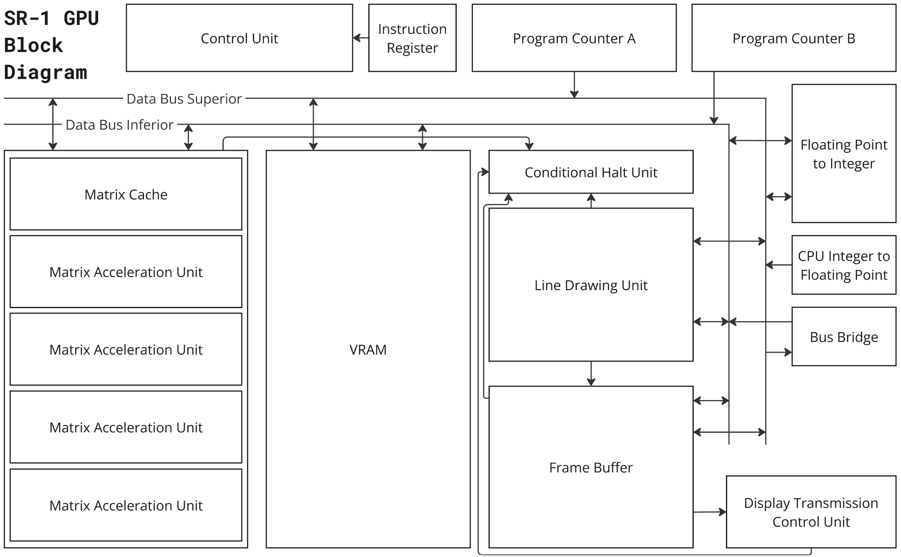
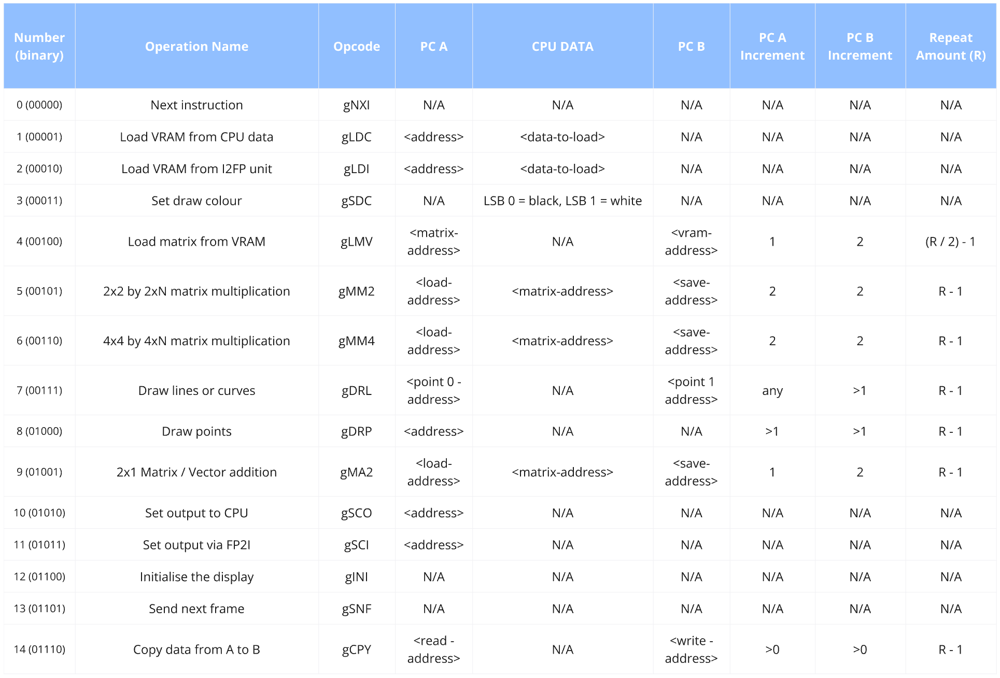

## Project
  
This is a 16bit CPU and GPU that I have written in SystemVerilog.

[Watch the Tetrahedron Demo on YouTube](https://youtu.be/6NJTSfFw-bk)

## License
This project is licensed under the **Creative Commons Attribution-NonCommercial 4.0 International (CC BY-NC 4.0)**.  
See the [LICENSE](LICENSE) file for more details, especially regarding media, as this is not covered under the above license.

## Programming
You can use the custom simple assembly language to create a .sa file, which can then be [assembled](HelperPrograms/sa_assembler.py) into a .mi file for recreating the [DP_BSRAM8 file](CPU/Memory/gowin_dpb/dp_bsram8.v)  
The parameters to do so are as follows:
- Module Name: 	    DP_BSRAM8
- Address Depth:	32768 (for both ports)
- Data Width:		8 (for both ports)
- Read Mode: 		Bypass
- Write Mode:		Normal
- Reset Mode:		Asynchronous
However there is also a [AutoHotKey](HelperPrograms/BSRAM_Instantiate.ahk) script to automate the entry of these fields as it gets very tedious very fast.

## Synthesis
This SoC was synthesised onto a [Sipeed Tang Nano 9k](https://wiki.sipeed.com/hardware/en/tang/Tang-Nano-9K/Nano-9K.html).  
I put it onto a breadboard to connect all the IO, as seen below.

## CPU Block Diagram
For more info see the docs (Not made yet)  

## CPU Registers

## CPU Opcodes

## GPU Block Diagram

## GPU Opcodes

## Synthesised Chip Array

Just because it is so beautiful!